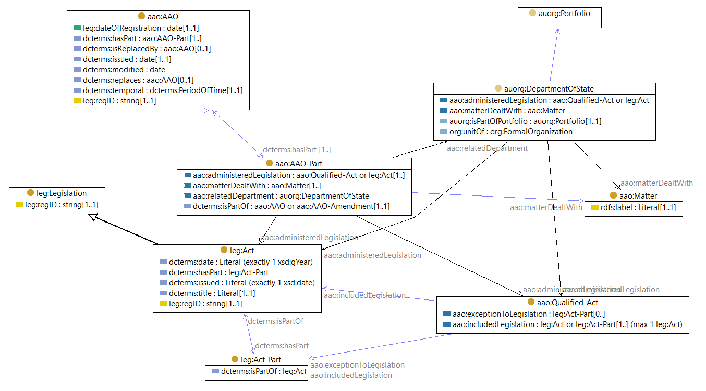
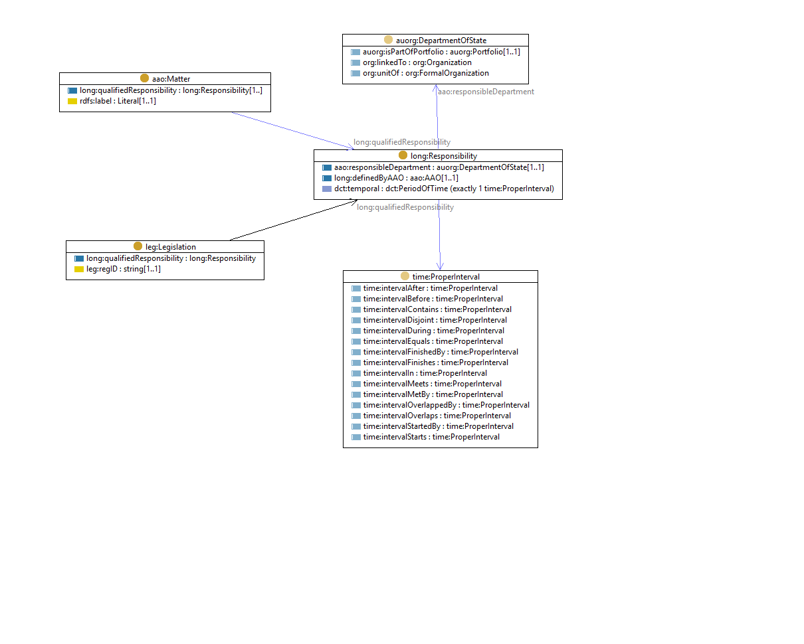
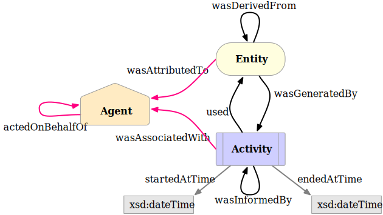
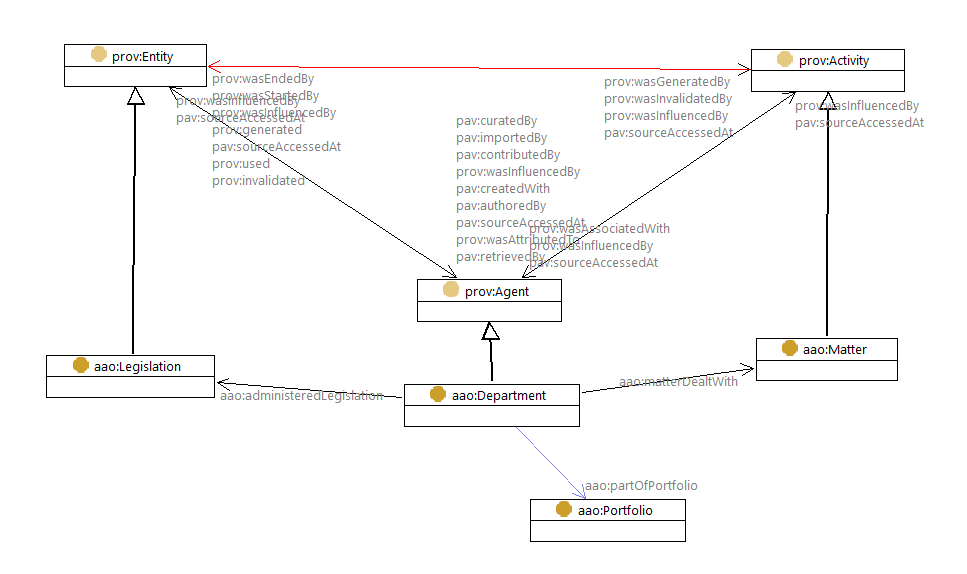
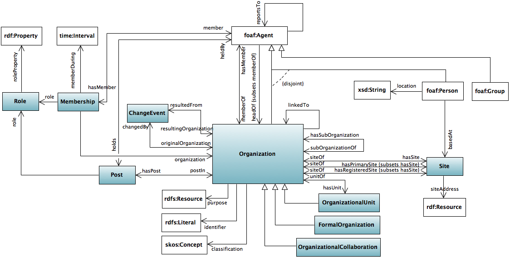
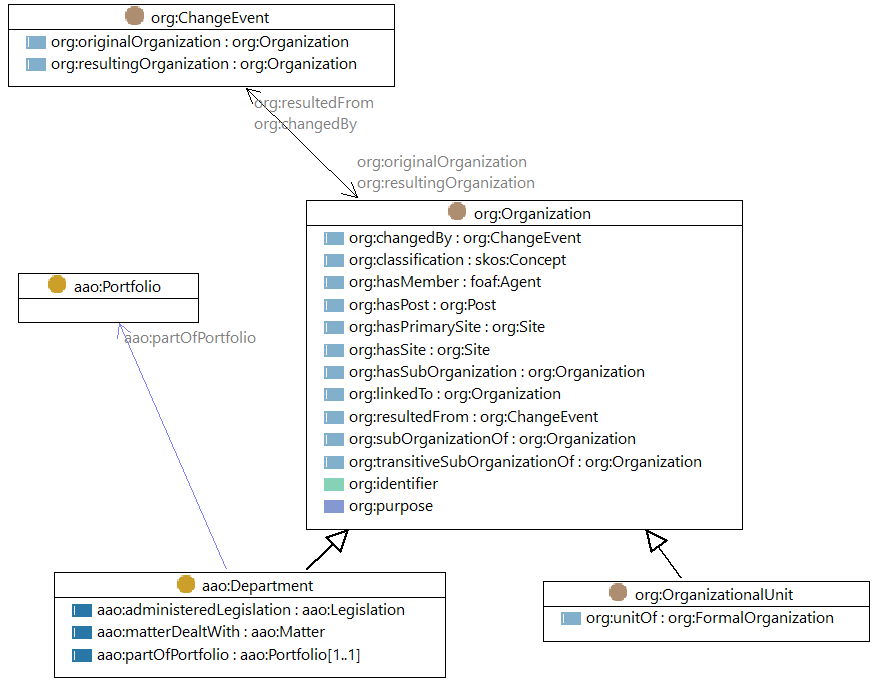
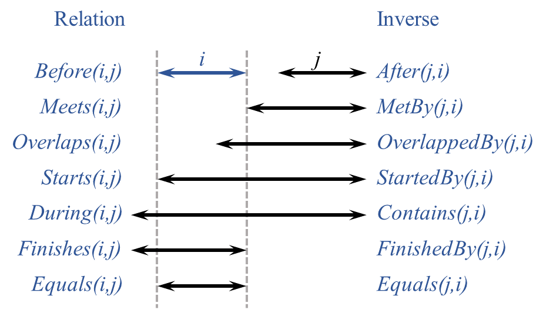

# Administrative Arrangement Orders ontology

This is an [OWL2](https://www.w3.org/OWL/) ontology that models the elements within the Australian Government's Administrative Arrangement Orders (AAOs).

This ontology and instance data have been created for the *Longitudinal Spine of Government Functions* project which is
a [Platforms for Open Data](https://pmc.gov.au/public-data/open-data/platforms-open-data)-funded project involving
[CSIRO](https://www.csiro.au/), the [Department of Finance](https://www.finance.gov.au/), the [National Archives of
Australia](http://naa.gov.au/) and other interested agencies.

## Source
This ontology is based on the current structure of an AAO instance as listed at the [Federal Register of Legislation](https://www.legislation.gov.au/Browse/ByRegDate/AdministrativeArrangementsOrders/), e.g. [AAO for "2nd Gillard Adminstration"](https://www.legislation.gov.au/Details/C2010Q00191)
.
A [comprehensive archive of AAOs](http://www.naa.gov.au/information-management/information-governance/aao/index.aspx) is also available from the
[National Archives of Australia](http://www.naa.gov.au).

## Classes
### Administrative Arrangement Order structure
An `AAO` is composed of a set of numbered `Parts`, each relating to a single `Department of State` which provides a list of the `matters dealt with` and the `legislation administered` by the department. Each `Matter` is expressed as a text phrase. Each item of `Legislation` is either (i) one dated `Act` optionally excluding one or more `parts`, or (ii) one or more parts of an Act.  Thus, the ontology includes classes for each of these concepts:



Figure: The AAO ontology's main classes and properties.

`aao:AAO` is an Administrative Arrangements Order. When issued, it replaces the previous AAO. The time interval that it is in force is indicated using `dct:temporal` and ends when it is replaced. It is subject to amendment by a `aao:AAO-Amendment`

`aao:AAO-Part` is an **Association Class** which
- links the **department** to the **matters** and **legislation** that it is responsible for **while this AAO is in force**
- asserts the existence of a **matter** specified using the given wording, while this AAO is in force

Administered legislation refers to an `leg:Act`, optionally with excluded parts that are administered by another department. 

`leg:Act` is an Act of Parliament. The year that it was enacted is indicated by the `dct:date`. An Act is composed of one or more `leg:Act-Part`

`aao:Qualified-Act` is a collection which refers to either 
- an `leg:Act` excluding some `leg:Act-Part(s)`, else to 
- a group of `leg:Act-Part` excluded from the administrative responsibility of another department. 

`leg:Legislation` is the superclass of acts, legislative-, notifiable-, and prerogative-instruments, which are listed in the [Federal Register of Legislation](https://www.legislation.gov.au/Home).

`aao:Matter` is an area of responsibility denoted by its `rdfs:label` which is a descriptive phrase. 

The description of each Department of State should be formalized as an `auorg:DepartmentOfState` using the [Au Org Ontology](https://github.com/CSIRO-enviro-informatics/auorg-ont

Code example:

```
<http://test.linked.data.gov.au/dataset/aaos/aao/20101014>
  rdf:type aao:AAO ;
  leg:dateOfRegistration "2010-11-18"^^xsd:date ;
  leg:regID "C2010Q00232" ;
  dct:hasPart aaos:C2010Q00232-1 ;
  dct:hasPart aaos:C2010Q00232-2 ;
  dct:hasPart aaos:C2010Q00232-3 ;
...
  dct:isReplacedBy aaos:C2011Q00073 ;
  dct:issued "2010-10-14"^^xsd:date ;
  dct:replaces aaos:C2010Q00191 ;
  dct:temporal aaos:C2010Q00232-T ;
  rdfs:label "Administrative Arrangements Order - C2010Q00232" ;
  rdfs:seeAlso <http://www.naa.gov.au/information-management/information-governance/aao/2010-10-14.aspx> ;
  rdfs:seeAlso <https://www.legislation.gov.au/Details/C2010Q00232> ;
  time:hasTime <http://linked.data.gov.au/dataset/epochs/trs/aao/20101014> ;
.

aaos:C2010Q00232-1
  rdf:type aao:AAO-Part ;
  aao:administeredLegislation act:C2004A04749 ;
  aao:administeredLegislation act:C2005C00188 ;
  aao:matterDealtWith <http://test.linked.data.gov.au/dataset/matter/15> ;
  aao:matterDealtWith <http://test.linked.data.gov.au/dataset/matter/158> ;
  aao:matterDealtWith <http://test.linked.data.gov.au/dataset/matter/2> ;
  aao:matterDealtWith <http://test.linked.data.gov.au/dataset/matter/300> ;
  aao:matterDealtWith <http://test.linked.data.gov.au/dataset/matter/329> ;
  aao:matterDealtWith <http://test.linked.data.gov.au/dataset/matter/330> ;
  aao:matterDealtWith <http://test.linked.data.gov.au/dataset/matter/352> ;
  aao:matterDealtWith <http://test.linked.data.gov.au/dataset/matter/4> ;
  aao:matterDealtWith <http://test.linked.data.gov.au/dataset/matter/55> ;
  aao:matterDealtWith <http://test.linked.data.gov.au/dataset/matter/56> ;
  aao:responsibleDepartment <http://test.linked.data.gov.au/dataset/department/1> ;
  rdfs:label "PART 1       THE DEPARTMENT OF AGRICULTURE, FISHERIES AND FORESTRY" ;
.
```
See [aaos-test.ttl](./data/aaos-test.ttl). 

### Responsibility for legislation and matters
Each `AAO` describes a set of responsibilities from an organizational viewpoint, sorted by each Department of State, over a specified time interval. 
A more functional view, centered on legislation and matters, can be constructed from this. 
Since legislation and matters typically persist across multiple AAOs, with the responsibility either remaining with or passing from one department to another when a new AAO is issued, the functional view will be a time-sequence of associations from the function to the responsible department. 
There are several complications in mapping this data to a strict functional timeline, inclcuding
- Departments routinely change name as their responsibilities shift
- 'matters' are denoted by a text phrase, which may shift for either substantial reasons, or due to minor wording changes that have no significance of substance
- ... 

A generic structure for expressing the sequence of responsibility which respects the formal conceptualization of the AAO is summarized in this figure: 



Each `aao:Matter`, `leg:Act` or `aao:Qualified-Act` has one or more `aao:qualifiedResponsibility` whose value is a node of type `aao:Responsibility`. The latter indicates the associated Department of State using `aao:responsibleDepartment`, the temporal interval over which this applies using `dct:temporal`, and the Part of which Adminstrative Arrangements Order that establishes this using `aao:definedByAAO`. 

Code example:

SPARQL query
```
INSERT  { 
?m aao:qualifiedResponsibility [
	a aao:Responsibility ; 
	aao:definedByAAO ?p ;
	aao:responsibleDepartment ?d ;
	dct:temporal ?t ; ] .
}
WHERE {
	?p aao:matterDealtWith ?m . 
	?p aao:responsibleDepartment ?d .
	?a dct:hasPart ?p . 
	?a dct:temporal ?t .
}
```

supplements the initial information about a 'matter' to produce

```
<http://test.linked.data.gov.au/dataset/matter/15>
  rdf:type aao:Matter ;
  rdfs:label "Agricultural, pastoral, fishing, food and forest industries" ;
  aao:qualifiedResponsibility [
      rdf:type aao:Responsibility ;
      aao:definedByAAO aaos:C2010Q00191-1 ;
      aao:responsibleDepartment <http://test.linked.data.gov.au/dataset/department/1> ;
      dcterms:temporal aaos:C2010Q00191-T ;
    ] ;
  aao:qualifiedResponsibility [
      rdf:type aao:Responsibility ;
      aao:definedByAAO aaos:C2010Q00232-1 ;
      aao:responsibleDepartment <http://test.linked.data.gov.au/dataset/department/1> ;
      dcterms:temporal aaos:C2010Q00232-T ;
    ] ;
.
```

See [aaos-test-processing.ttl](./data/aaos-test-processing.ttl). 

## Ontology representations
* [aao.ttl](aao.ttl) - the formal RDF (turtle) ontology document
* [aao.html](aao.html) - a human-readable, HTML, from the ontology document (TBD)
* [aao.png](aao.png) - a top-level diagram of the ontology classes
* [aao.shacl.ttl](aao.shacl.ttl) - a [SHACL](https://www.w3.org/TR/shacl/) shape graph for validating AAO data (TBD)
* [aao.profile.ttl](aao.profile.ttl) - a [Profiles Ontology](https://www.w3.org/TR/prof/) description of this ontology (TBD)

## Instance data
See [aaos-test.ttl](data/aaos-test.ttl) for examples of AAOs formalized using the AAO Ontology and presented in RDF.
These refer to: 
- [acts-test.ttl](data/acts-test.ttl) (a small set of examples)
- [matters.ttl](data/matters.ttl) (complete set for the last 10 years)
- [departments.ttl](data/departments.ttl) (complete set for the last 10 years) 

### Identifiers
Identifiers for **AAOs** and for **Legislation** are taken from the [Federal Register of Legislation](https://www.legislation.gov.au), e.g.
- [C2010Q00191](data/aaos.ttl) [AAO for 2nd Gillard Administration](https://www.legislation.gov.au/Details/C2010Q00191)
- C2004A01468 [Acts Citation Act 1976](https://www.legislation.gov.au/Details/C2004A01468)
- C2004A04340 [A.C.T. Supreme Court (Transfer) Act 1992](https://www.legislation.gov.au/Details/C2004A04340)
- C2004A04749 [Agricultural and Veterinary Chemical Products Levy Imposition (Customs) Act 1994](https://www.legislation.gov.au/Details/C2004A04749)

What are the best identifiers for
- **Departments** (AGOR is only good for current state)
- **Matters** (text ...)?

How can we align **Matters** to **Functions**?

## Alignments
### PROV-O
PROV-O provides a standard formalization of the relationships between Entities (e.g. Legislation), Agents (e.g. Departments and Agencies) and Activities.



The main classes in the AAO ontology can be aligned to the W3C PROV Ontology as shown in the following diagram:



Figure: provisional alignment of the principal classes from the AAO Ontology with PROV-O.

### ORG
ORG provides a standard formalization of organizational structures, organizational change events, and the relationships between persons and organizations.



The main classes in the AAO ontology can be aligned to the W3C Organization Ontology as shown in the following diagram:



Figure: provisional alignment of the principal classes from the AAO Ontology with ORG.

### OWL-time
The time interval during which an AAO is in force will be related to other time intervals describing aspects of government, such as
- parliaments
- governments
- ministries

The relationships between these may be described following the relationships defined by Allen:



## License
This ontology and all other content in this repository are licensed under the
[Creative Commons Attribution 4.0 International (CC BY 4.0)](https://creativecommons.org/licenses/by/4.0/)
(local copy of deed: [LICENSE](LICENSE)).

## Contacts
*Ontology author*:  
**Nicholas Car**  
*Senior Experimental Scientist*  
CSIRO Land & Water, Brisbane, Australia    
<nicholas.car@csiro.au>  
<http://orcid.org/0000-0002-8742-7730>  

**Simon J D Cox**  
*Research Scientist*  
CSIRO Land & Water, Melbourne, Australia    
<simon.cox@csiro.au>  
<http://orcid.org/0000-0002-3884-3420>  

*Data preparation & modelling*:  
**David Morton**  
<david.morton@finance.gov.au>  
Department of Finance   
