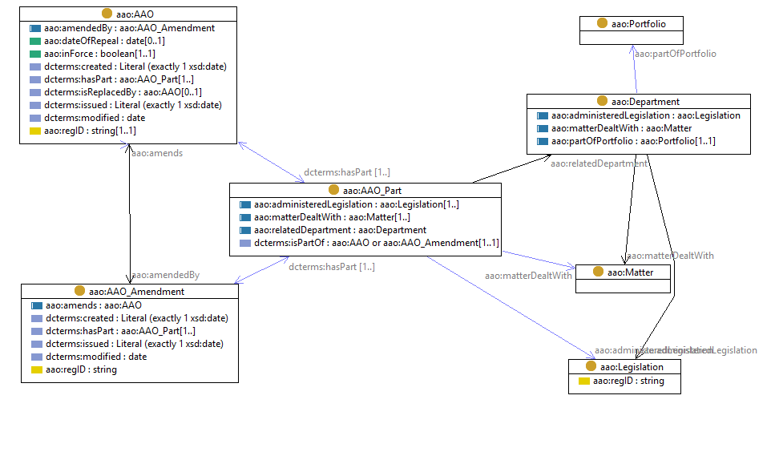

# Administrative Arrangement Orders ontology

This is an [OWL2](https://www.w3.org/OWL/) ontology that models the elements within the Australian Government's Administrative Arrangement Orders (AAOs).

This ontology and instance data have been created for the *Longitudinal Spine of Government Functions* project which is
a [Platforms for Open Data](https://pmc.gov.au/public-data/open-data/platforms-open-data)-funded project involving
[CSIRO](https://www.csiro.au/), the [Department of Finance](https://www.finance.gov.au/), the [National Archives of
Australia](http://naa.gov.au/) and other interested agencies.

## Source
This ontology is based on the current structure of an AAO instance as listed at the [Federal Register of Legislation](https://www.legislation.gov.au/Browse/ByRegDate/AdministrativeArrangementsOrders/), e.g. [AAO for 2nd Rudd Government](https://www.legislation.gov.au/Details/C2010Q00191)
.
A [comprehensive archive of AAOs](http://www.naa.gov.au/information-management/information-governance/aao/index.aspx) is also available from the
[National Archives of Australia](http://www.naa.gov.au).

## Classes
An `AAO` is composed of a set of numbered `Parts`, each relating to a single `Department of State` which provides a list of the `Matters dealt with` and the `Legislation administered` by the department. Thus, the ontology includes classes for each of these concepts, as shown in this diagram:

Figure: A top-level diagram of the AAO ontology's main classes and properties.

An `aao:AAO_Part` serves as an **Association Class** which links the **department** to the **matters** and **legislation** that it is responsible for **while this AAO is in force** in the date range `dct:isPartOf/dct:issued` &rarr; `dct:isPartOf/aao:dateOfRepeal`.

## Ontology representations
* [aao.ttl](aao.ttl) - the formal RDF (turtle) ontology document
* [aao.html](aao.html) - a human-readable, HTML, from the ontology document (TBD)
* [aao.png](aao.png) - a top-level diagram of the ontology classes
* [aao.shacl.ttl](aao.shacl.ttl) - a [SHACL](https://www.w3.org/TR/shacl/) shape graph for validating AAO data (TBD)
* [aao.profile.ttl](aao.profile.ttl) - a [Profiles Ontology](https://www.w3.org/TR/prof/) description of this ontology (TBD)

## Instance data
See [aaos.ttl](data/aaos.ttl) for examples of AAOs formalized using the AAO Ontology and presented in RDF. Identifiers for AAOs and for Legislation are taken from the [Federal Register of Legislation](https://www.legislation.gov.au), e.g.
- [C2010Q00191](data/aaos.ttl) [AAO for 2nd Rudd Government](https://www.legislation.gov.au/Details/C2010Q00191)
- C2004A01468 [Acts Citation Act 1976](https://www.legislation.gov.au/Details/C2004A01468)
- C2004A04340 [A.C.T. Supreme Court (Transfer) Act 1992](https://www.legislation.gov.au/Details/C2004A04340)
- C2004A04749 [Agricultural and Veterinary Chemical Products Levy Imposition (Customs) Act 1994](https://www.legislation.gov.au/Details/C2004A04749)

_What are the best identifiers for (a) Departments (b) matters?_

## Alignments
### PROV-O
PROV-O provides a standard formalization of the relationships between Entities (e.g. Legislation), Agents (e.g. Departments and Agencies) and Activities.
The main classes in the AAO ontology can be aligned to the W3C PROV Ontology as shown in the following diagram:

Figure: provisional alignment of the principal classes from the AAO Ontology with PROV-O.

### ORG
ORG provides a standard formalization of organizational structures, organizational change events, and the relationships between persons and organizations.
The main classes in the AAO ontology can be aligned to the W3C Organization Ontology as shown in the following diagram:

Figure: provisional alignment of the principal classes from the AAO Ontology with ORG.

## License
This ontology and all other content in this repository are licensed under the
[Creative Commons Attribution 4.0 International (CC BY 4.0)](https://creativecommons.org/licenses/by/4.0/)
(local copy of deed: [LICENSE](LICENSE)).

## Contacts
*Ontology author*:  
**Nicholas Car**  
*Senior Experimental Scientist*  
CSIRO Land & Water, Brisbane, Australia    
<nicholas.car@csiro.au>  
<http://orcid.org/0000-0002-8742-7730>  

**Simon J D Cox**  
*Research Scientist*  
CSIRO Land & Water, Melbourne, Australia    
<simon.cox@csiro.au>  
<http://orcid.org/0000-0002-3884-3420>  

*Data preparation & modelling*:  
**David Morton**  
<david.morton@finance.gov.au>  
Department of Finance   
