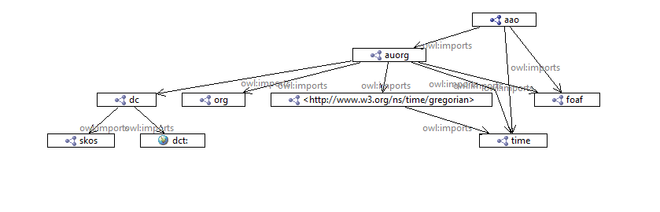
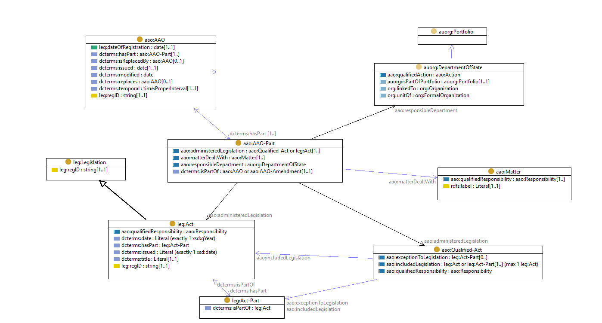

# Administrative Arrangement Orders ontology

This is an [OWL2](https://www.w3.org/OWL/) ontology that models the elements within the Australian Government's Administrative Arrangement Orders (AAOs).

This ontology and instance data have been created for the *Longitudinal Spine of Government Functions* project which is
a [Platforms for Open Data](https://pmc.gov.au/public-data/open-data/platforms-open-data)-funded project involving
[CSIRO](https://www.csiro.au/), the [Department of Finance](https://www.finance.gov.au/), the [National Archives of
Australia](http://naa.gov.au/) and other interested agencies.

## Data

A [sample dataset](data.md) using this ontology is available.

## Source
This ontology is based on the current structure of an AAO instance as listed at the [Federal Register of Legislation](https://www.legislation.gov.au/Browse/ByRegDate/AdministrativeArrangementsOrders/), e.g. [AAO for "2nd Gillard Adminstration"](https://www.legislation.gov.au/Details/C2010Q00191)
.
A [comprehensive archive of AAOs](http://www.naa.gov.au/information-management/information-governance/aao/index.aspx) is also available from the
[National Archives of Australia](http://www.naa.gov.au).

## Dependencies

## Namespaces
The AAO ontology is partitioned into two namespaces, [aao:](http://linked.data.gov.au/def/aao#) and [leg:](http://linked.data.gov.au/def/legislation#), and uses elements from the [Au Org Ontology](https://github.com/CSIRO-enviro-informatics/auorg-ont) in the namespace [auorg:](http://linked.data.gov.au/def/auorg).

## Classes
An `AAO` is composed of a set of numbered `Parts`, each relating to a single `Department of State` which provides a list of the `matters dealt with` and the `legislation administered` by the department. Each `Matter` is expressed as a text phrase. Each item of `Legislation` is either (i) one dated `Act` optionally excluding one or more `parts`, or (ii) one or more parts of an Act.  Thus, the ontology includes classes for each of these concepts:

Figure: The AAO ontology's main classes and properties.

### Adminstrative Arrangement Order
#### `aao:AAO`
is an Administrative Arrangements Order. When issued, it replaces the previous AAO. The time interval that it is in force is indicated using `dct:temporal` and ends when it is replaced. It is subject to amendment by a `aao:AAO-Amendment`

#### `aao:AAO-Part`
is an **Association Class** which
- links the **department** to the **matters** and **legislation** that it is responsible for **while this AAO is in force**
- asserts the existence of a **matter** specified using the given wording, while this AAO is in force

### Legislation and matters
Administered legislation refers to an `leg:Act`, optionally with excluded parts that are administered by another department.

#### `leg:Legislation`
is the superclass of acts, legislative-, notifiable-, and prerogative-instruments, which are listed in the [Federal Register of Legislation](https://www.legislation.gov.au/Home).

#### `leg:Act`
is an Act of Parliament. The year that it was enacted is indicated by the `dct:date`. An Act is composed of one or more `leg:Act-Part`

#### `aao:Qualified-Act`
is a collection which refers to either
- an `leg:Act` excluding some `leg:Act-Part(s)`, else to
- a group of `leg:Act-Part` excluded from the administrative responsibility of another department.

#### `aao:Matter`
is an area of responsibility denoted by its `rdfs:label` which is a descriptive phrase.

A key question is how `aao:Matter` relates to `agrif:Function` (which is defined as part of the [Commonwealth Record Series system ontology](https://github.com/CSIRO-enviro-informatics/crs-ont). 

### Organisations
The description of each Department of State should be formalized as an `auorg:DepartmentOfState` using the [Au Org Ontology](https://github.com/CSIRO-enviro-informatics/auorg-ont

Each department is part of a `auorg:Portfolio`

## Ontology representations
* [aao.ttl](schema/aao.ttl) - the formal RDF (turtle) ontology document
* [aao.html](aao.html) - a human-readable, HTML, from the ontology document (TBD)
* [aao.png](image/aao.png) - a top-level diagram of the ontology classes
* [aao.shacl.ttl](shape/aao.shacl.ttl) - a [SHACL](https://www.w3.org/TR/shacl/) shape graph for validating AAO data (TBD)
* [aao.profile.ttl](profile/aao.profile.ttl) - a [Profiles Ontology](https://www.w3.org/TR/prof/) description of this ontology (TBD)
* [auorg.ttl](https://raw.githubusercontent.com/CSIRO-enviro-informatics/auorg-ont/master/auorg.ttl) the AU Org Ontology

## Processing
### Time sequence
Processing the AAOs into a time-sequence with OWL-Time relationships is described in [aao-time-processing](aao-time-processing.md) - results in [aao-time.ttl](data/aao-time.ttl)

### Responsibility for Functions
Processing the AAOs to get a view of functional responsibility is described in [function-responsibility](function-responsibility.md) - results in [aao-all.ttl](data/aao-all.ttl)

## Alignments
### PROV-O
PROV-O provides a standard formalization of the relationships between Entities (e.g. Legislation), Agents (e.g. Departments and Agencies) and Activities.

The main classes in the AAO ontology can be aligned to the W3C PROV Ontology as shown in the following diagram:

Figure: provisional alignment of the principal classes from the AAO Ontology with PROV-O.

### ORG
ORG provides a standard formalization of organizational structures, organizational change events, and the relationships between persons and organizations.

The main classes in the AAO ontology can be aligned to the W3C Organization Ontology as shown in the following diagram:

Figure: provisional alignment of the principal classes from the AAO Ontology with ORG.

### OWL-time
The time interval during which an AAO is in force will be related to other time intervals describing aspects of government, such as
- parliaments
- governments
- ministries

The relationships between these may be described following the relationships defined by Allen:

## License
This ontology and all other content in this repository are licensed under the
[Creative Commons Attribution 4.0 International (CC BY 4.0)](https://creativecommons.org/licenses/by/4.0/)
(local copy of deed: [LICENSE](LICENSE)).

## Contacts
*Ontology author*:  
**Nicholas Car**  
*Senior Experimental Scientist*  
CSIRO Land & Water, Brisbane, Australia    
<nicholas.car@csiro.au>  
<http://orcid.org/0000-0002-8742-7730>  

**Simon J D Cox**  
*Research Scientist*  
CSIRO Land & Water, Melbourne, Australia    
<simon.cox@csiro.au>  
<http://orcid.org/0000-0002-3884-3420>  

*Data preparation & modelling*:  
**David Morton**  
<david.morton@finance.gov.au>  
Department of Finance   
