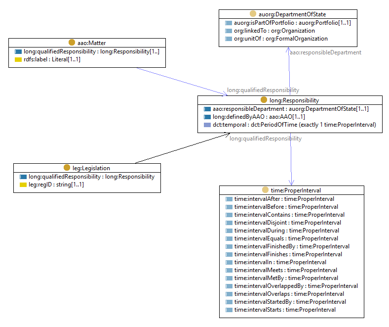

# Responsibility for legislation and matters
Each `AAO` describes a set of responsibilities from an organizational viewpoint, sorted by each Department of State, over a specified time interval.
A more functional view, centered on legislation and matters, can be constructed from this.

The model for 'responsibility' follows the qualified-relation pattern:



A Matter or Legislation is linked to a department during a specified time interval.
The time intervals will form a sequence.
The relationships between members of the sequence can be described using the Allen's interval relations, as specified in [OWL-Time](https://www.w3.org/TR/owl-time/).

The set of `Responsibility` individual for a matter or piece of legislation can be computed as follows:

```
CONSTRUCT {
	?matter long:qualifiedResponsibility [
		a long:Responsibility ;
		long:definedByAAO ?aao ;
		aao:responsibleDepartment ?dept ;
		dct:temporal ?aaot ;
	] .
}
WHERE {
	?matter a aao:Matter .
	?part a aao:AAO-Part ;
		dct:isPartOf ?aao ;
		aao:responsibleDepartment ?dept ;
		aao:matterDealtWith ?matter .
   ?aao dct:temporal ?aaot .
}
```

## Time series

The sequence of responsibility for Matters can then be computed using this SPARQL query:
```
SELECT ?matter ?dept ?mb
WHERE {
	?m a aao:Matter ;
		dct:description ?matter ;
		long:qualifiedResponsibility ?mr .
	?mr dct:temporal/time:hasBeginning/time:inXSDDate ?mb .
	?mr aao:responsibleDepartment ?md .
	?md dct:title ?dept .
}
ORDER BY ?matter ASC(?mb)
```

Extract from https://github.com/CSIRO-enviro-informatics/aao-ont/data/matter-sequence.tsv:

| matter | dept | begin | 
| --- | --- | --- | 
| ... | ... | ... | 
| Energy efficiency | Environment, Water, Heritage and the Arts | 2008-01-25 |
| Energy efficiency | Environment, Water, Heritage and the Arts | 2008-05-01 |
| Energy efficiency | Climate Change and Energy Efficiency | 2010-03-08 |
| Energy efficiency | Climate Change and Energy Efficiency | 2010-05-06 |
| Energy efficiency | Climate Change and Energy Efficiency | 2010-06-29 |
| Energy efficiency | Climate Change and Energy Efficiency | 2010-09-14 |
| Energy efficiency | Climate Change and Energy Efficiency | 2010-10-14 |
| Energy efficiency | Climate Change and Energy Efficiency | 2011-10-19 |
| Energy efficiency | Climate Change and Energy Efficiency | 2011-12-07 |
| Energy efficiency | Climate Change and Energy Efficiency | 2011-12-14 |
| Energy efficiency | Climate Change and Energy Efficiency | 2012-02-09 |
| Energy efficiency | Resources, Energy and Tourism | 2013-03-25 |
| Energy efficiency | Resources, Energy and Tourism | 2013-05-16 |
| Energy efficiency | Industry | 2013-09-18 |
| Energy efficiency | Industry | 2013-10-03 |
| Energy efficiency | Industry | 2013-12-12 |
| Energy efficiency | Industry and Science | 2014-12-23 |
| Energy efficiency | Industry and Science | 2015-07-09 |
| Energy efficiency | Industry, Innovation and Science | 2015-09-21 |
| Energy efficiency | Industry, Innovation and Science | 2015-09-30 |
| Energy efficiency | Industry, Innovation and Science | 2016-02-18 |
| Energy efficiency | Environment and Energy | 2016-07-19 |
| Energy efficiency | Environment and Energy | 2016-09-01 |
| Energy efficiency | Environment and Energy | 2016-10-27 |
| Energy efficiency | Environment and Energy | 2017-04-13 |
| Energy efficiency | Environment and Energy | 2017-11-30 |
| Energy efficiency | Environment and Energy | 2017-12-20 |
| Energy efficiency | Environment and Energy | 2018-04-19 |
| Energy efficiency | Environment and Energy | 2018-05-10 |
| Energy efficiency | Environment and Energy | 2018-08-28 |
| Energy efficiency policy and standards | Climate Change | 2007-12-03 |
| Energy policy | Resources, Energy and Tourism | 2007-12-03 |
| Energy policy | Resources, Energy and Tourism | 2008-01-25 |
| Energy policy | Resources, Energy and Tourism | 2008-05-01 |
| ... | ... | ... | 

A sequence of responsibility for Legislation can be computed using this SPARQL query:
```
SELECT ?act ?dept ?begin ?end
WHERE {
	?a a leg:Act ;
		dct:title ?act .
	?part a aao:AAO-Part ;
		dct:isPartOf ?aao ;
		aao:responsibleDepartment/dct:title ?dept ;
		aao:administeredLegislation ?a .
  ?aao dct:temporal/time:hasBeginning/time:inXSDDate ?begin .
  OPTIONAL { ?aao dct:temporal/time:hasEnd/time:inXSDDate ?end . }
}
ORDER BY ?act ASC( ?begin )
```

Extract from https://github.com/CSIRO-enviro-informatics/aao-ont/data/act-sequence.tsv:

| act | dept | begin | end |
| --- | --- | --- | --- |
| ... | ... | ... | ... |
| Equal Employment Opportunity (Commonwealth Authorities) Act 1987 | Employment and Workplace Relations | 2001-11-26 | 2003-12-17 |
| Equal Employment Opportunity (Commonwealth Authorities) Act 1987 | Employment and Workplace Relations | 2003-12-18 | 2004-10-25 |
| Equal Employment Opportunity (Commonwealth Authorities) Act 1987 | Employment and Workplace Relations | 2004-10-26 | 2004-12-15 |
| Equal Employment Opportunity (Commonwealth Authorities) Act 1987 | Employment and Workplace Relations | 2004-12-16 | 2005-07-20 |
| Equal Employment Opportunity (Commonwealth Authorities) Act 1987 | Employment and Workplace Relations | 2005-07-21 | 2006-01-26 |
| Equal Employment Opportunity (Commonwealth Authorities) Act 1987 | Employment and Workplace Relations | 2006-01-27 | 2006-09-20 |
| Equal Employment Opportunity (Commonwealth Authorities) Act 1987 | Employment and Workplace Relations | 2006-09-21 | 2007-01-29 |
| Equal Employment Opportunity (Commonwealth Authorities) Act 1987 | Employment and Workplace Relations | 2007-01-30 | 2007-12-02 |
| Equal Employment Opportunity (Commonwealth Authorities) Act 1987 | Education, Employment and Workplace Relations | 2007-12-03 | 2008-01-24 |
| Equal Employment Opportunity (Commonwealth Authorities) Act 1987 | Education, Employment and Workplace Relations | 2008-01-25 | 2008-04-30 |
| Equal Employment Opportunity (Commonwealth Authorities) Act 1987 | Education, Employment and Workplace Relations | 2008-05-01 | 2010-03-07 |
| Equal Employment Opportunity (Commonwealth Authorities) Act 1987 | Education, Employment and Workplace Relations | 2010-03-08 | 2010-05-05 |
| Equal Employment Opportunity (Commonwealth Authorities) Act 1987 | Education, Employment and Workplace Relations | 2010-05-06 | 2010-06-28 |
| Equal Employment Opportunity (Commonwealth Authorities) Act 1987 | Prime Minister and Cabinet | 2010-06-29 | 2010-09-13 |
| Equal Employment Opportunity (Commonwealth Authorities) Act 1987 | Prime Minister and Cabinet | 2010-09-14 | 2010-10-13 |
| Equal Employment Opportunity (Commonwealth Authorities) Act 1987 | Prime Minister and Cabinet | 2010-10-14 | 2011-10-18 |
| Equal Employment Opportunity (Commonwealth Authorities) Act 1987 | Prime Minister and Cabinet | 2011-10-19 | 2011-12-06 |
| Equal Employment Opportunity (Commonwealth Authorities) Act 1987 | Prime Minister and Cabinet | 2011-12-07 | 2011-12-13 |
| Equal Employment Opportunity (Commonwealth Authorities) Act 1987 | Infrastructure and Transport | 2011-12-14 | 2012-02-08 |
| Equal Employment Opportunity (Commonwealth Authorities) Act 1987 | Prime Minister and Cabinet | 2012-02-09 | 2013-03-24 |
| Equal Employment Opportunity (Commonwealth Authorities) Act 1987 | Prime Minister and Cabinet | 2013-03-25 | 2013-05-15 |
| Equal Employment Opportunity (Commonwealth Authorities) Act 1987 | Prime Minister and Cabinet | 2013-05-16 | 2013-09-17 |
| Equal Employment Opportunity (Commonwealth Authorities) Act 1987 | Prime Minister and Cabinet | 2013-09-18 | 2013-10-02 |
| Equal Employment Opportunity (Commonwealth Authorities) Act 1987 | Prime Minister and Cabinet | 2013-10-03 | 2013-12-12 |
| Equal Employment Opportunity (Commonwealth Authorities) Act 1987 | Prime Minister and Cabinet | 2013-12-12 | 2014-12-22 |
| Equal Employment Opportunity (Commonwealth Authorities) Act 1987 | Prime Minister and Cabinet | 2014-12-23 | 2015-07-08 |
| Equal Employment Opportunity (Commonwealth Authorities) Act 1987 | Prime Minister and Cabinet | 2015-07-09 | 2015-09-20 |
| Equal Employment Opportunity (Commonwealth Authorities) Act 1987 | Prime Minister and Cabinet | 2015-09-21 | 2015-09-29 |
| Equal Employment Opportunity (Commonwealth Authorities) Act 1987 | Prime Minister and Cabinet | 2015-09-30 | 2016-02-17 |
| Equal Employment Opportunity (Commonwealth Authorities) Act 1987 | Prime Minister and Cabinet | 2016-02-18 | 2016-07-18 |
| Equal Employment Opportunity (Commonwealth Authorities) Act 1987 | Prime Minister and Cabinet | 2016-07-19 | 2016-08-31 |
| Equal Employment Opportunity (Commonwealth Authorities) Act 1987 | Prime Minister and Cabinet | 2016-09-01 | 2016-10-26 |
| Equal Employment Opportunity (Commonwealth Authorities) Act 1987 | Prime Minister and Cabinet | 2016-10-27 | 2017-04-12 |
| Equal Employment Opportunity (Commonwealth Authorities) Act 1987 | Prime Minister and Cabinet | 2017-04-13 | 2017-11-29 |
| Equal Employment Opportunity (Commonwealth Authorities) Act 1987 | Prime Minister and Cabinet | 2017-11-30 | 2017-12-19 |
| Equal Employment Opportunity (Commonwealth Authorities) Act 1987 | Prime Minister and Cabinet | 2017-12-20 | 2018-04-18 |
| Equal Employment Opportunity (Commonwealth Authorities) Act 1987 | Prime Minister and Cabinet | 2018-04-19 | 2018-05-09 |
| Equal Employment Opportunity (Commonwealth Authorities) Act 1987 | Prime Minister and Cabinet | 2018-05-10 | 2018-08-27 |
| Equal Employment Opportunity (Commonwealth Authorities) Act 1987 | Prime Minister and Cabinet | 2018-08-28 |  |
| Equal Employment Opportunity for Women in the Workplace Act 1999 | Employment and Workplace Relations | 2001-11-26 | 2003-12-17 |
| Equal Opportunity for Women in the Workplace Act 1999 | Employment and Workplace Relations | 2003-12-18 | 2004-10-25 |
| Equal Opportunity for Women in the Workplace Act 1999 | Employment and Workplace Relations | 2004-10-26 | 2004-12-15 |
| Equal Opportunity for Women in the Workplace Act 1999 | Employment and Workplace Relations | 2004-12-16 | 2005-07-20 |
| ... | ... | ... | ... |

## Persistent representation of responsibility

Since legislation and matters typically persist across multiple AAOs, with the responsibility either remaining with or passing from one department to another when a new AAO is issued, the functional view will be a time-sequence of associations from the function to the responsible department.
There are several complications in mapping this data to a strict functional timeline, including
- Departments routinely change name as their responsibilities shift
- 'matters' are denoted by a text phrase, which may shift for either substantial reasons, or due to minor wording changes that have no significance of substance
- ...
